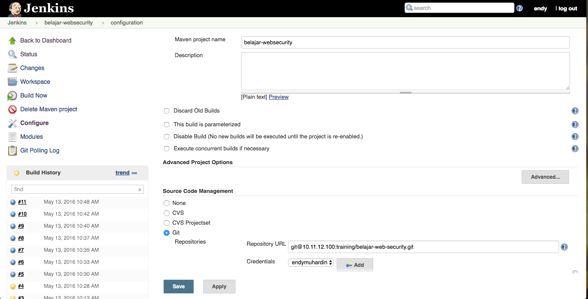
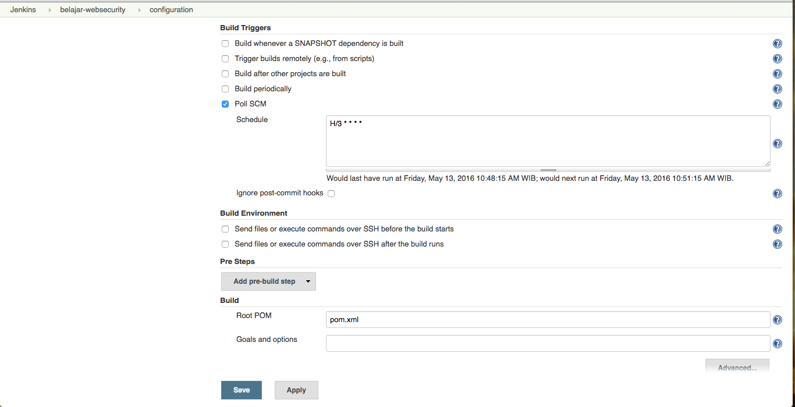
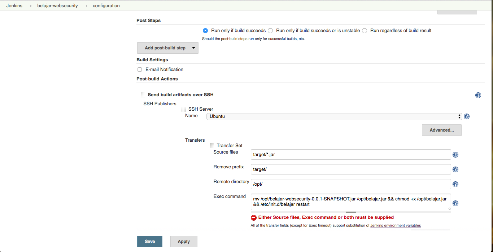

# Deploy Aplikasi Spring Boot #

Beberapa metode :

* Deploy ke PaaS (cloud services) : [Heroku atau Openshift](http://software.endy.muhardin.com/java/project-bootstrap-03/)
* Deploy ke Java EE AppServer : deploy sebagai war
* Deploy ke dedicated Linux box : deploy sebagai service

## Deploy ke PAAS ##

* [Deploy ke Openshift](https://www.youtube.com/watch?v=RQvPwPd14Tk)
* [Deploy ke Heroku](https://www.youtube.com/watch?v=C6qCF7pIbVI)

## Deploy War ##

* [Maven Cargo Plugin](https://dzone.com/articles/automated-deployment-cargo-and)

## Deploy ke dedicated Linux box ##

1. Set executable : memasang init script di awal jar file

	```xml
	<plugin>
		<groupId>org.springframework.boot</groupId>
		<artifactId>spring-boot-maven-plugin</artifactId>
          <configuration>
             <executable>true</executable>
          </configuration>
	</plugin>
	```

2. Copy file `target/*.jar` ke server
3. Di server : symlink ke `/etc/init.d/`
4. Di server : start `/etc/init.d/namafile start`


## Otomasi Deployment dengan Jenkins ##

* Install dulu plugin [Publish Over SSH](https://wiki.jenkins-ci.org/display/JENKINS/Publish+Over+SSH+Plugin)

* Konfigurasi Plugin


* Konfigurasi Repository Project



* Konfigurasi scheduler, tiap 3 menit cek ke repository. Kalau ada update, jalankan build



* Post build action. Deploy ke server kalau build sukses

